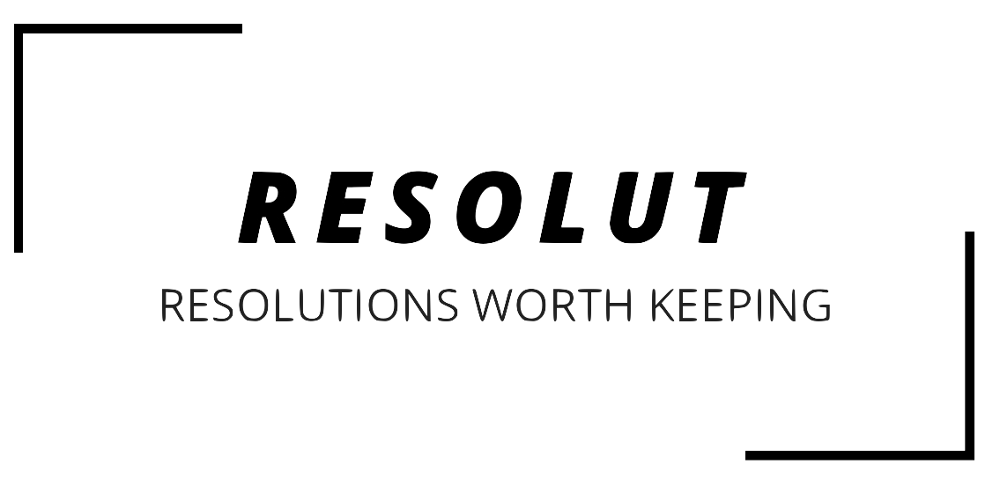

# wdi-project-three

### A MEAN stack web app built with AngularJS

The Resolut app tracks time goals set for Mind, Body and Soul and is a platform for hosting, finding and signing up for events which go towards achieving those goals.

*This is the original team Repo as it was at the end of the project*

## Table of Contents
* [Brief](#brief)
* [Tech Used](#tech)
* [Process](#process)
* [Challenges](#challenges)
* [Wins](#wins)
* [Next Up](#next)

* [Click](https://intense-beyond-35594.herokuapp.com/) to view site

## Brief

Technical Requirements:

**Server Side**
- **Use Mongo, Node & Express** to build a server-side API
- **Your API must have at least 2 related models**, one of which should be a user
- **Your API should include all RESTFUL actions** for at least one of those models
- **Include authentication** to restrict access to appropriate users
- **Include at least one referenced or embedded sub-document**
- **Include automated tests** for at least one resource

**Client Side**
- **Use Angular** to build a front-end that consumes your API
- **Use SCSS** instead of CSS
- **Use Webpack & Yarn** to manage your dependencies and compile your source code

MVP Deliverables:
- **A working API,** built by the whole team, hosted somewhere on the internet
- **A handmade Angular front-end** that consumes your own API, hosted somewhere on the internet
- A **link to your hosted working app** in the URL section of your Github repo
- A **team git repository hosted on Github**, with a link to your hosted project, and frequent commits from every team member dating back to the very beginning of the project

## Technologies Used:

`AngularJS`
`Express.js`
`MongoDB`
`Mongoose`
`bcrypt`
`Vanilla Javascript`
`Moment.js`
`Chart.js`
`Mocha`
`Chai`
`Webpack`
`JSON Web Token`
`SASS (SCSS)`
`Bulma`
`CSS 3`
`HTML 5`
`Git`
`Atom`
`Insomnia`
`GitHub`
`Trello`

## The Process
### Planning
The two of us underwent a full days planning before we started to code the app. We originally focussed on the concept which led us to the user flows. Sophie then worked on the first draft wireframes (see images below) and Sean worked on the models. The two of us then re-conviened and went over each others work and ideas, further fleshing out both the models and wireframes. As we went, we added tasks to our team [Trello](https://trello.com/b/mdTpDMaI) board which we used to track our progress through the project.

Once we had a good idea of the user and data flows right through the app we began the build.

### The Build
Initially Sean worked on the back end, focussing on the models and the testing while Sophie built out front end infrastructure and started getting the basic layout of the client side sorted.

...

## Challenges

## Wins

## Next up
